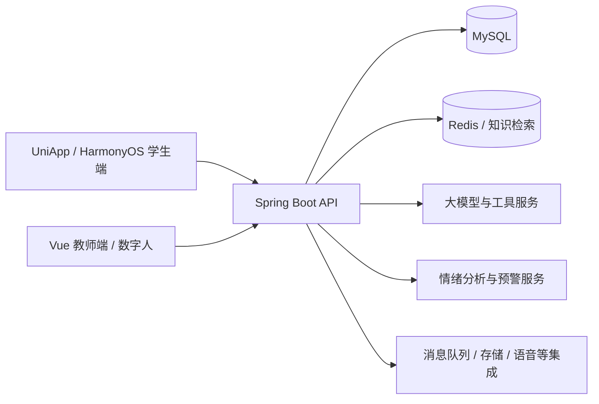

# 心晴 · 校园心理健康支持平台

**AI 陪聊、情绪记录、心理测评、咨询预约与教师工作台，一套面向校园的多端心理支持项目。**

心晴把学生日常自助与教师服务连接起来：学生可以记录心情、与 AI 交流、学习心理知识、参加放松活动，也可以向教师预约和求助；教师可以管理内容与预约，结合分析界面查看需要复核的信息。项目包含 UniApp 学生端、HarmonyOS 学生端、Vue 教师端、Java 后端和数字人 Web 工程。

历年参赛版本使用过 **心晴、EmoChat、倾心、织心** 等名称。本仓库汇集较完整的业务源码、真实界面与演示、实际训练权重、合成数据及部署文档。

[完整演示与截图](docs/MEDIA.md) · [配置与部署](docs/CONFIGURATION.md) · [模型下载与推理](MODEL_CARD.md) · [获奖记录](docs/AWARDS.md) · [本次整理清单](docs/RELEASE_CONTENTS.md)

## 先看项目

[](https://github.com/myheart521/xinqing/releases/download/v1.1.0/xinqing-complete-demo.mp4)

**[▶ 观看／下载完整演示](https://github.com/myheart521/xinqing/releases/download/v1.1.0/xinqing-complete-demo.mp4)**

完整演示选自 **2025 年 8 月的软件杯“织心”金蝶云苍穹适配版本，约 6 分 24 秒，保留讲解音轨**。内容覆盖教师智能体、数字人、知识工具，以及学生陪聊、社区、测评、放松、预约与沟通。公开版对账户信息、私人地址和记录等做了定点处理。

该视频展示历史平台适配场景；仓库中的通用应用采用下述 Vue、UniApp 与 Spring Boot 技术栈。视频时间导航与图片说明见 [MEDIA.md](docs/MEDIA.md)。

| 学生功能入口 | 测评题库 | 音乐与白噪声 | 数字人交互 |
| :---: | :---: | :---: | :---: |
|  |  |  |  |

以上来自项目实际界面。更多教师端、知识阅读、运动饮食、虚拟展厅和原始架构图见[截图集](docs/MEDIA.md)。

## 能做什么

| 场景 | 主要功能 |
| --- | --- |
| AI 交流与陪伴 | 流式对话、数字人交互、对话中的工具与功能推荐 |
| 情绪与测评 | 心情日记、情绪历史、心理测评及结果查询 |
| 知识与社区 | 心理文章、帖子互动、活动、检索辅助问答 |
| 放松与日常生活 | 小游戏、音乐、运动与饮食相关页面 |
| 师生服务 | 教师信息、咨询预约、即时消息与预约处理 |
| 教师工作台 | 学生与内容管理、AI 助手、预警分析及人工复核 |

功能入口与端到端流程见[项目说明](docs/PROJECT.md)。语音、数字人、对象存储和部分工具需要使用者配置自己的服务与授权。

## 模型已经作为附件提供

两份下载都包含**实际训练权重**，放在 GitHub Release 中，避免大文件占用 Git 源码历史。

| 模型 | 下载内容 | 使用条件 |
| --- | --- | --- |
| [心晴 Qwen V2 LoRA](https://github.com/myheart521/xinqing/releases/download/v1.1.0/xinqing-qwen-v2-lora.tar.gz) | 约 240 MB 的实际 LoRA 权重，以及适配器配置、分词器和许可 | 另行下载 `Qwen/Qwen2.5-3B-Instruct` 基座后加载；遵守 Qwen RESEARCH 许可 |
| [心晴 RBT3 情绪／风险分类模型](https://github.com/myheart521/xinqing/releases/download/v1.1.0/xinqing-rbt3-emotion-risk.tar.gz) | 约 154 MB 的完整分类权重，含编码器、分类头、配置和分词器 | 解压后可直接用本地推理脚本加载；Apache-2.0 |
| [合成训练数据](https://github.com/myheart521/xinqing/releases/download/v1.1.0/psych-health-synthetic-114900.jsonl.gz) | 114,900 条模板生成样本，JSONL gzip 格式 | CC BY 4.0；有生成脚本与校验值 |

表中大小为未压缩权重的大约十进制大小，下载包大小以 Release 为准。Qwen 下载的是微调产生的增量权重；它需要基座才能生成文本。RBT3 下载包已经包含推理所需的编码器参数。

从仓库根目录开始，下载并把两个模型包解压到 `models/`，然后运行：

```bash
python -m venv .venv-models
# Linux/macOS: source .venv-models/bin/activate
# PowerShell: .venv-models/Scripts/Activate.ps1
pip install -r requirements-models.txt

# RBT3：加载本地完整分类模型。
python inference/classify_emotion.py --model-dir models/xinqing-rbt3-emotion-risk --text "最近学习压力很大"

# Qwen：首次运行还需取得基座，建议使用可用的 GPU。
python inference/chat_qwen.py --model-dir models/xinqing-qwen-v2-lora --prompt "最近学习压力很大"
```

完整下载、解压、校验、硬件与训练参数见[模型卡](MODEL_CARD.md)。合成数据可用 `python scripts/generate_synthetic_dataset.py --output train.synthetic.jsonl` 独立重建；数据来源、重复与工具参数质量问题见[数据集卡](DATASET_CARD.md)。

## 代码结构

| 目录 | 内容与技术 |
| --- | --- |
| [`backend/`](backend/) | Java 17 / Spring Boot 3.3.3；公共模块、数据对象与业务服务；MyBatis-Plus、Sa-Token、Spring AI、LangChain4j |
| [`admin/`](admin/) | Vue 3 / TypeScript / Vite / Element Plus 教师与管理端 |
| [`mobile/`](mobile/) | UniApp 学生端，包含完整公共模块及补回的功能页面 |
| [`harmony/`](harmony/) | HarmonyOS 学生端工程与资源 |
| [`digital-human/`](digital-human/) | 独立数字人 Web 界面与 SDK 集成入口 |
| [`database/`](database/) | 62 张表的空库结构 |
| [`inference/`](inference/) / [`training/`](training/) | 模型推理入口与训练脚本 |
| [`rag/`](rag/) | DOCX 知识分块、向量生成代码与知识库整理说明 |
| [`docs/`](docs/) | 配置、功能、截图、奖项与发布验证记录 |



这次重新整理补回了较新的后端鉴权、工具意图及预警配置代码，恢复普通图标、插画和小游戏贴图，并把完整参赛学生端与较新功能页合并。具体版本选择及材料去向见[整理清单](docs/RELEASE_CONTENTS.md)。

## 启动应用

准备 JDK 17、Maven、MySQL 8、Redis、RabbitMQ，以及前端所需的 Node.js。启用向量检索时，Redis 需要支持相应搜索与向量索引能力。

1. 克隆仓库：`git clone https://github.com/myheart521/xinqing.git`。
2. 创建自己的 `xinqing` 数据库，导入 `database/schema.sql`。
3. 按 [CONFIGURATION.md](docs/CONFIGURATION.md) 和 `.env.example` 设置数据库、Redis、消息队列、模型及启用的外部服务配置。
4. 在独立终端中分别启动后端与教师端：

```bash
# 从仓库根目录进入后端。
cd backend
mvn -DskipTests package
java -jar xinqing-service/target/xinqing-service-0.0.1-SNAPSHOT.jar
```

```bash
# 另一个终端，从仓库根目录进入教师端。
cd admin
npm install
npm run dev
```

学生端用 HBuilderX 打开 `mobile/`，鸿蒙端用 DevEco Studio 打开 `harmony/`；连接地址、应用标识、签名和平台要求见[移动端配置](docs/MOBILE_CONFIGURATION.md)。

根目录 `.env.example` 是配置清单，Spring Boot 不会自动读取根目录 `.env`，需要把变量设置到终端、IDE 或运行容器中。空库没有原用户、管理员账号及菜单权限数据，部署时应初始化自己的实例。已完成的构建、测试及尚未验证的运行环节见 [VALIDATION.md](docs/VALIDATION.md)。

## 获奖记录

| 年份 | 比赛 | 成绩 |
| --- | --- | --- |
| 2024 | 第十七届中国大学生计算机设计大赛 | 三等奖 |
| 2024 | 第十八届 iCAN 大学生创新创业大赛河南赛区选拔赛 | 三等奖 |
| 2025 | 中国高校计算机大赛网络技术挑战赛中部赛区 | 二等奖 |
| 2025 | 第二十七届中国机器人及人工智能大赛全国总决赛·人工智能创新赛 | 二等奖 |
| 2025 | 第十四届中国软件杯大学生软件设计大赛决赛·普通高校组 | 三等奖（金蝶云苍穹适配作品） |

各奖项对应的历史作品名、证据关系，以及软件杯金蝶适配版本的记录见[获奖说明](docs/AWARDS.md)。

## 公开范围与许可

本仓库不包含真实咨询对话、学生测评记录、日记、个人身份材料或原部署凭据。截图与视频经过定点处理，配置使用环境变量或示例地址。心理支持、分类与预警功能供学习和研究，输出需要专业人员复核，不构成医学诊断。

项目自有代码使用 [MIT](LICENSE)；各目录保留的独立第三方许可证仍然适用。Qwen 相关权重采用 [Qwen RESEARCH 许可](licenses/LICENSE-QWEN)，RBT3 模型采用 Apache-2.0，合成数据采用 [CC BY 4.0](LICENSE-DATA)。共同开发成果、第三方 SDK 与素材的说明见 [THIRD_PARTY_NOTICES.md](THIRD_PARTY_NOTICES.md)。
