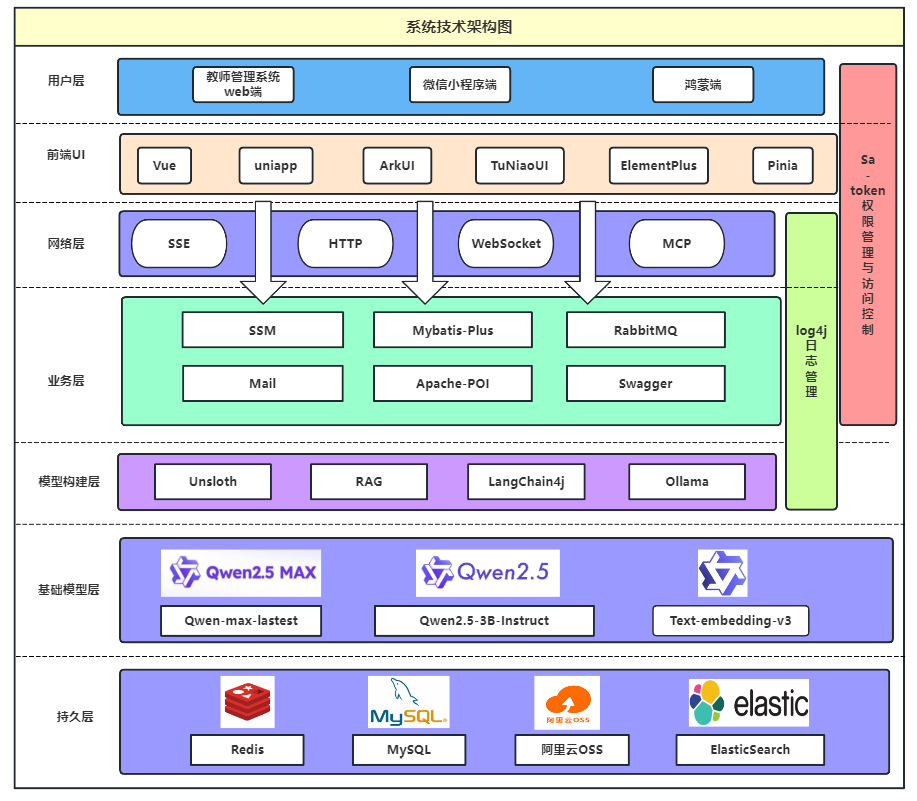
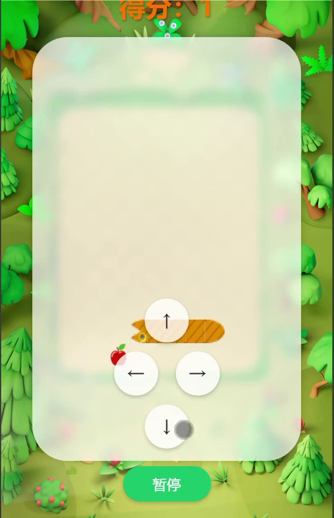

# 心晴 · 校园心理健康支持平台

面向学生和心理咨询教师的多端项目，围绕心理知识、交流陪伴、情绪记录、测评预约、教师工作台和大模型辅助服务组织功能。历史参赛版本使用过 **心晴、EmoChat、织心、倾心** 等名称。本仓库整理代码、架构材料和可公开的实验资源，便于学习与继续开发。

> 心理支持功能用于学习和研究，不提供医学诊断；模型输出和预警结果需要专业人员复核。比赛演示与本次公开源码属于不同阶段，不能将演示中的所有集成视为开箱即用。



上图提取自项目演示材料，展示当时的整体方案。实际依赖及可用范围以代码和[配置说明](docs/CONFIGURATION.md)为准。

## 内容导航

| 目录或文档 | 内容 |
| --- | --- |
| `backend/` | Java 17、Spring Boot 3.3.3，多模块业务服务 |
| `admin/` | Vue 3、TypeScript、Element Plus 教师与管理端 |
| `mobile/` | UniApp 学生端 |
| `harmony/` | 鸿蒙学生端参赛源码 |
| `digital-human/` | 数字人界面及集成边界；厂商 SDK 与授权需另行取得 |
| `database/schema.sql` | 62 张表的结构，不含用户、咨询记录、账号或业务数据 |
| [项目说明](docs/PROJECT.md) | 功能、技术分工、历史版本和适用边界 |
| [配置说明](docs/CONFIGURATION.md) | MySQL、Redis、模型、OSS、邮件等配置 |
| [获奖记录](docs/AWARDS.md) | 比赛名称、级别及历史项目名称对应关系 |
| [模型卡](MODEL_CARD.md) / [数据集卡](DATASET_CARD.md) | 历史微调实验、已发布数据和未发布部分的原因 |
| [验证与限制](docs/VALIDATION.md) | 本次实际检查结果及未验证的集成 |

## 主要功能

- 学生端：心理知识浏览、社区交流、情绪与日常记录、测评、预约及放松活动。
- 教师与管理端：学生服务、内容管理、交流记录、心理状态分析及预警相关模块。
- AI 服务：对话、模型配置、知识库检索和工具调用等集成代码，涉及 Spring AI、LangChain4j、Ollama 与外部模型服务。
- 多端交互：HTTP、SSE 和 WebSocket；数字人、语音、地图、邮件和对象存储作为可配置的外部集成。

原有生产连接、密钥、签名文件和用户数据库没有纳入公开版本。部分浏览器端付费 AI/语音接口已停止直接持有密钥，需由使用者实现服务端授权或代理；详见配置说明。

## 快速开始

```bash
git clone https://github.com/myheart521/xinqing.git
cd xinqing

# 配置本机 MySQL，创建空库后导入结构。
mysql -u YOUR_DB_USER -p xinqing < database/schema.sql

# 先按 docs/CONFIGURATION.md 配置进程环境变量。
cd backend
mvn -DskipTests package

# 另一个终端：教师管理端。
cd admin
npm install
npm run dev
```

以上前后端命令分别从仓库根目录进入对应目录。`.env.example` 是配置清单；Spring Boot 不会自动读取根目录 `.env`，需要在终端、IDE 或容器运行环境中设置变量。空库不包含管理员账号、菜单权限或业务初始化数据，需要按自己的部署设计初始化。

## 演示与比赛成果

[](https://github.com/myheart521/xinqing/releases/download/v1.0.0-source/mental-relaxation-demo.mp4)

[观看/下载演示片段](https://github.com/myheart521/xinqing/releases/download/v1.0.0-source/mental-relaxation-demo.mp4)。这是经过裁选的静音功能演示；完整原视频中的用户记录、账号和配置页面没有公开。

| 年份 | 比赛 | 获奖级别 |
| --- | --- | --- |
| 2024 | 第十七届中国大学生计算机设计大赛 | 三等奖 |
| 2024 | 第十八届 iCAN 大学生创新创业大赛河南赛区选拔赛 | 三等奖 |
| 2025 | 中国高校计算机大赛网络技术挑战赛中部赛区 | 二等奖 |
| 2025 | 第二十七届中国机器人及人工智能大赛全国总决赛·人工智能创新赛 | 二等奖 |

不同年份使用的作品名及证据对应方式见[获奖记录](docs/AWARDS.md)。本仓库不将其他独立改编作品的奖项计入，也不把立项或参赛经历写成获奖。

## 模型和数据

本次发布 **114,900 条纯模板生成的校园心理支持样本**、独立生成脚本、校验值和数据集卡。生成结果与历史独立合成子集逐字节一致。

- [下载合成数据集](https://github.com/myheart521/xinqing/releases/download/v1.0.0-source/psych-health-synthetic-114900.jsonl.gz)
- 从零复现：`python scripts/generate_synthetic_dataset.py --output train.synthetic.jsonl`
- [模型卡](MODEL_CARD.md)记录 Qwen2.5-3B-Instruct LoRA 微调参数和历史指标。

**本次没有发布历史模型权重和混合训练集。** 历史训练包含私人聊天参考改写及多种第三方语料，相关权利和模型记忆风险尚未完整核实；基座另受 Qwen RESEARCH 许可证约束。纯模板数据也存在重复和工具参数不匹配等问题，不是临床验证数据。

## 许可证

代码按 [MIT](LICENSE) 及各子目录保留的上游许可使用；合成数据单独采用 [CC BY 4.0](LICENSE-DATA)。第三方模型、SDK、商标及演示中的外部展品不受代码 MIT 许可覆盖。项目包含共同开发和上游组件，版权归各自权利人所有，详见 [THIRD_PARTY_NOTICES.md](THIRD_PARTY_NOTICES.md)。
