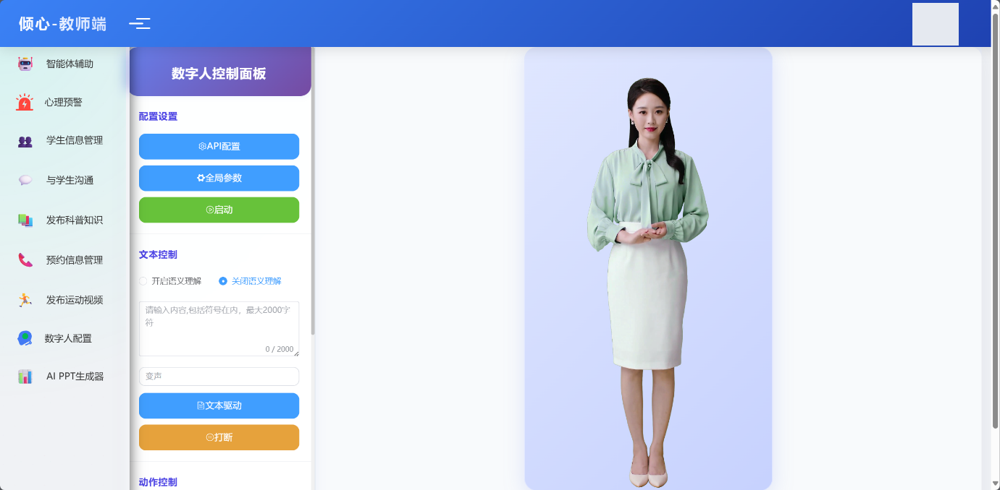
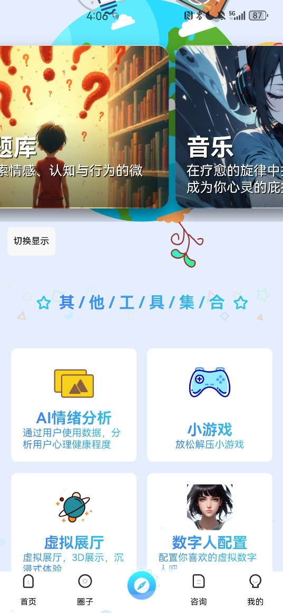
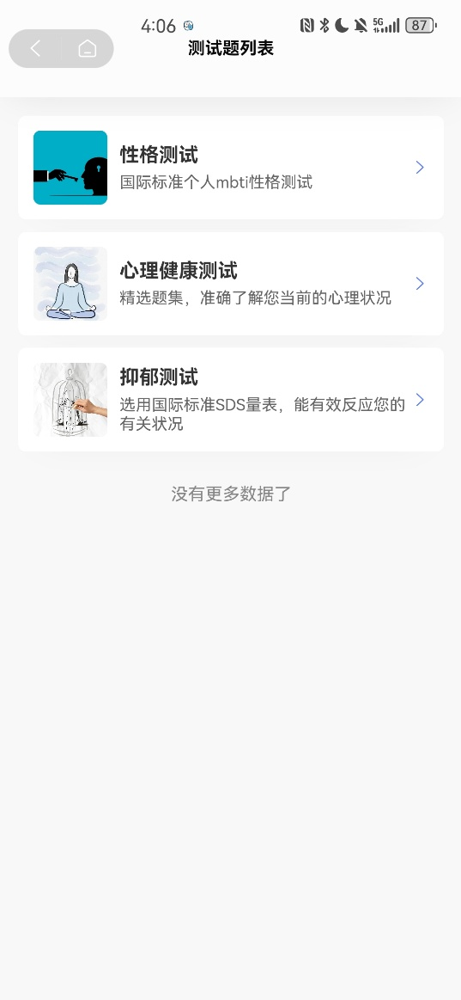
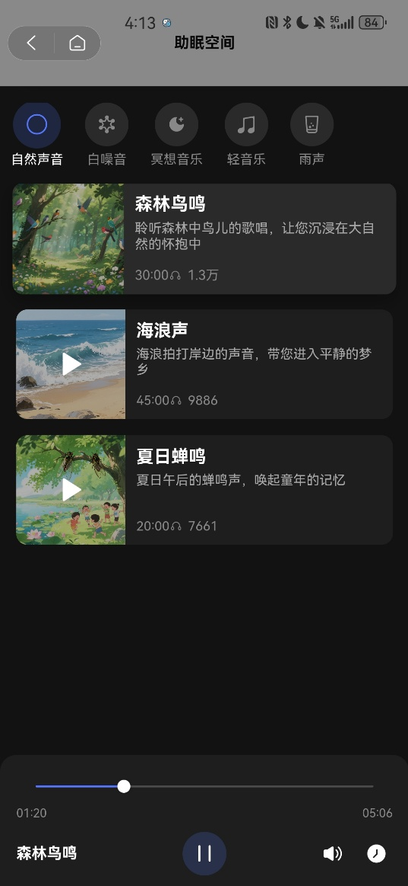
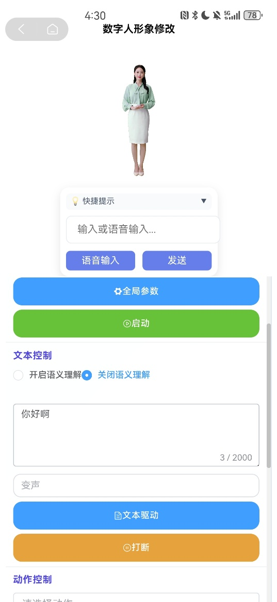
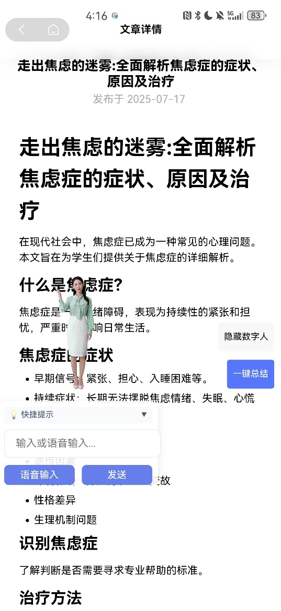
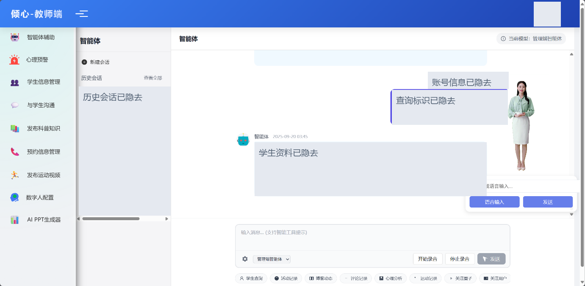
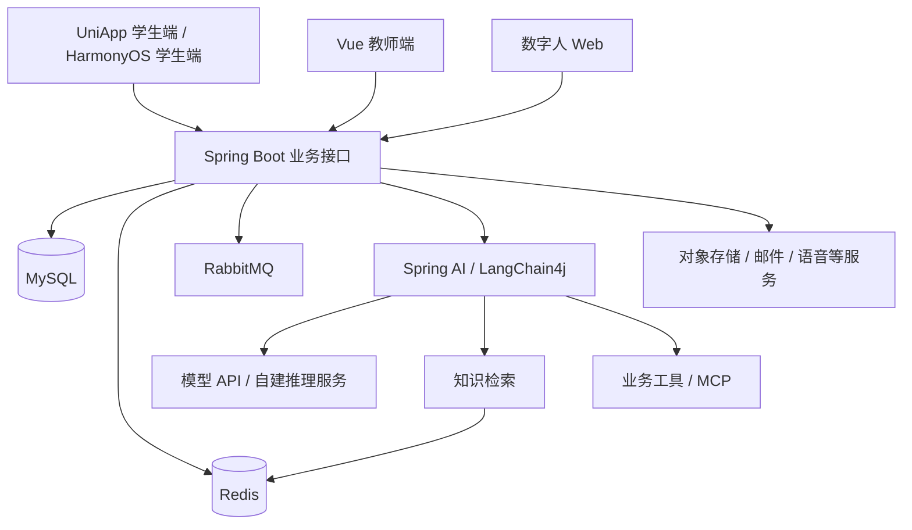

# 心晴

心晴是一个面向大学生的心理健康项目，有学生端、教师端和配套的 AI 服务。学生可以在手机上聊天、记心情、做测评、看科普内容，也可以查找咨询老师、选择时段预约。教师端负责学生信息、预约和内容管理，并提供一个可以查询业务数据的 AI 助手。

项目里保留了不少不同阶段的开发内容：鸿蒙端、UniApp 学生端、数字人、心理问答模型、情绪分类模型，以及后来的工具调用和预警逻辑。这里把代码、模型和参赛材料放在一起，方便了解实现，也方便继续开发。应用需要连接数据库和外部服务，部署方法在下文说明。

源码和材料中出现的 EmoChat、倾心、织心都是历年使用过的项目名称。2024 年的材料以鸿蒙心理陪聊系统和 EmoChat 为主；2025 年网络技术挑战赛使用“倾心”，机器人及人工智能大赛、软件杯材料中则使用“织心”。读代码时遇到这些名字，可以结合[获奖记录](docs/AWARDS.md)查看对应版本。

[演示视频](https://github.com/myheart521/xinqing/releases/download/v1.1.0/xinqing-complete-demo.mp4) · [模型与数据下载](https://github.com/myheart521/xinqing/releases/tag/v1.1.0) · [配置说明](docs/CONFIGURATION.md) · [模型卡](MODEL_CARD.md)

## 演示

[](https://github.com/myheart521/xinqing/releases/download/v1.1.0/xinqing-complete-demo.mp4)

[完整视频，6 分 24 秒，约 52 MB](https://github.com/myheart521/xinqing/releases/download/v1.1.0/xinqing-complete-demo.mp4)。视频先演示教师端，再演示学生端，包含数字人、模型问答、社区、测评、音乐、运动、预约和师生沟通。

选用的是 2025 年 8 月保存的软件杯版本，其中有金蝶云苍穹的适配画面。仓库中的应用主体是 Vue、UniApp 和 Spring Boot，金蝶平台需要单独接入。视频保留原来的功能顺序和主要旁白，个人资料、咨询记录、服务地址等区域已经遮盖。各功能出现的时间见[视频导航](docs/MEDIA.md)。

| 学生端功能入口 | 测评题库 | 音乐与白噪声 | 数字人设置 |
| :---: | :---: | :---: | :---: |
|  |  |  |  |

## 学生端

### 聊天与数字人

学生可以在聊天页面输入问题，后端以流式方式返回回答。对话接入了聊天记忆和知识检索；工具调用部分可以从业务库中查询音乐、帖子、活动、科普文章、运动内容、测评题库和咨询老师，再把查询结果交给模型组织回答。例如，聊到学习压力时，模型可以查询平台现有的放松内容或测评入口。推荐内容是否丰富，取决于部署时录入了哪些数据。

数字人页面提供形象展示、文本驱动、语音输入和动作控制。学生端有相应的网页接入入口，教师端也有独立的控制面板。数字人 SDK、语音服务与文本模型分别配置，因此更换问答模型时仍然需要检查数字人和语音侧的连接。

这部分代码主要在 `mobile/function_pages/`、`digital-human/`，以及后端的 `controller/ai/`、`service/ai/` 和 `manage/StudentAgent/` 中。后端的工具定义可以直接从 [StudentTools.java](backend/xinqing-service/src/main/java/com/hpu/xinqing/manage/StudentAgent/tools/StudentTools.java) 开始看。

### 心情记录与心理测评

学生端有心情日记、情绪历史和个人记录页面。测评从题库进入，完成作答后可以查看结果，并在个人中心查看历史记录。演示中的题库包括性格、心理健康和抑郁相关测试；问卷内容、计分方式和结果说明由相应的数据与业务逻辑决定。

测评记录与 AI 对话分别保存。开发时可以沿着 `PsychologicalTestController`、`HistoryTestController` 和学生端的 `test-history`、`test-data-report` 页面查看数据如何传递。公开数据库只有表结构，导入后需要自行准备允许使用的量表和测试数据。

### 圈子、活动和知识阅读

圈子里有帖子、评论、点赞和关注，也有活动展示及参与记录。学生可以在个人中心找回自己参与的活动、关注的内容和收藏。相关页面集中在 `mobile/group_pages/`、`mobile/mine_pages/`，后端有博客、圈子、评论和活动等控制器。

心理科普页面支持文章阅读，历史演示还包含摘要和个人笔记。科普文章列表与供模型检索的知识库是两个入口：前者给学生直接阅读，后者为模型回答提供参考。维护内容时需要分别检查文章数据和检索索引。

### 咨询与预约

咨询中心展示老师信息，学生选择老师后可以查看可预约日期和时段，填写预约信息，也可以通过消息页面与老师沟通。教师端有对应的预约处理和聊天页面。

如果要继续做这部分，建议把学生端的 `mine_pages/appointment.vue` 与后端 `AppointmentController`、`TeacherController` 放在一起看，再检查 `admin/src/views/appointment/` 和 `admin/src/views/chat/`。前后端同时依赖登录状态，WebSocket 连接也需要完成鉴权。

### 放松与日常生活

学生端保留了音乐、助眠声音和小游戏，也有运动、饮食内容及历史记录页面。虚拟展厅通过网页展示心理科普内容，地址可以在集成配置中更换。鸿蒙工程和后端还保留设备、手表等相关接口，设备能力需要结合相应平台及硬件调试。

播放器、图标和小游戏贴图随源码提供。原来从私人 OSS 读取的文件需要换成自己的素材；具名商业歌曲没有整曲打包，播放器使用示例音源，部署时可以替换为取得授权的音乐。

| 科普阅读 | 运动与饮食 | 虚拟展厅 |
| :---: | :---: | :---: |
|  |  |  |

## 教师端

教师端用 Vue 3 和 Element Plus 开发，主要页面包括学生管理、内容发布、预约处理、师生聊天、心理预警、数字人设置和 AI PPT。教师可以直接操作这些页面，也可以在智能体页面输入查询要求。



智能体接入的业务工具在 [TeacherBasicTools.java](backend/xinqing-service/src/main/java/com/hpu/xinqing/manage/TeacherAgent/tools/TeacherBasicTools.java) 中。现有实现包括按学号查询学生信息、近期活动、帖子和评论，读取运动记录、关注与点赞情况，以及导出学生列表和测评记录。比如输入“查询某个学生最近两条活动记录”，工具会把学号和条数交给后端查询，再返回查询结果。使用时需要在自己的实例中建立相应权限和业务数据。

教师侧还接入了网页内容提取、文件生成、浏览器操作和地图等工具。部分调用依赖 MCP 或单独部署的服务，默认配置关闭了 MCP；这些服务安装并配置好以后，再启用对应入口。普通业务页面与这些扩展工具可以分别调试。

预警代码会组织近期帖子、活动、评论和对话等文本，把模型返回的风险信息交给业务策略处理。`MentalWarningPolicy` 负责等级映射、是否记录预警、是否通知教师等判断。模型的风险标签和业务页面的预警等级有各自的编号，接入新模型时应检查映射关系。教师仍需结合原始信息复核结果；量表、模型分类和预警分数都不能作为医学诊断。

AI PPT 页面使用文多多 iframe SDK，支持演示中的生成、编辑和导出流程，实际调用需要自己的服务账号与 token。SDK 的 GPL-3.0 许可随目录保留。教师端数字人同样需要单独配置供应商 SDK。

## 技术结构

后端使用 Java 17、Spring Boot 3.3.3，业务数据通过 MyBatis-Plus 访问 MySQL。Sa-Token 处理登录会话，Redis 用于缓存和向量检索，RabbitMQ 用于消息相关处理。前端的普通请求走 HTTP，流式回答使用 SSE，师生消息使用 WebSocket。



后端 Maven 工程分为三个模块。`xinqing-pojo` 放实体、DTO 和 VO；`xinqing-common` 放公共工具；`xinqing-service` 包含启动类、接口、业务服务、数据库映射和 AI 集成。查看某项功能时，可以先找到控制器，再沿 service 和 mapper 看下去。

### 对话、检索和工具调用

LangChain4j 的助手装配集中在 `Embedding/Init/AssistantInit.java`。学生助手接入学生工具和知识检索，教师助手接入教师工具，聊天记忆通过 `ChatMemoryProvider` 提供。仓库同时保留 Spring AI、百炼、Ollama 和兼容 OpenAI API 的调用方式，调试前需要确认当前使用的是哪条调用路径。

检索器在 `EmbeddingStoreContentRetrieverInit.java` 中配置：最多返回 10 个结果，最低分数为 0.7。Redis 向量存储配置为 1024 维。更换嵌入模型时，需要让输出维度与索引一致，并用新模型重新生成知识向量。

`rag/` 里保留了另一套离线处理脚本：从 DOCX 读取段落，清理、切分文本，再用 `shibing624/text2vec-base-chinese` 生成向量，输出 CSV、NumPy 和 JSON 文件。这套离线结果需要做格式与模型适配才能接入上述后端，不能直接把生成的 `data.json` 当作已导入的知识库。输入文档、输出目录和注意事项见 [rag/README.md](rag/README.md)。

### 代码目录

```text
xinqing/
├── backend/
│   ├── xinqing-common/       公共工具
│   ├── xinqing-pojo/         实体、DTO、VO
│   └── xinqing-service/      业务接口、AI 集成、启动入口
├── admin/                   Vue 教师端和管理页面
├── mobile/                  UniApp 学生端
│   ├── pages/               首页及主页面
│   ├── function_pages/      功能页面
│   ├── group_pages/         社区相关页面
│   ├── mine_pages/          个人中心、历史记录、预约等
│   └── service/             接口调用
├── harmony/                 HarmonyOS 学生端
├── digital-human/           数字人 Web 工程
├── database/schema.sql      62 张表的结构
├── inference/               Qwen 和 RBT3 推理脚本
├── training/                微调、分类器训练及导出脚本
├── rag/                     知识文档处理脚本
├── scripts/                 合成数据生成脚本
└── docs/                    配置、截图、奖项和验证记录
```

后端控制器的完整目录是 `backend/xinqing-service/src/main/java/com/hpu/xinqing/controller/`。教师端从 `admin/src/router/` 和 `admin/src/views/` 看起；学生端先看 `mobile/pages.json`，页面注册、主包和分包都在这里。HarmonyOS 的页面和网络工具位于 `harmony/entry/src/main/ets/`。

参赛 PPT 中的原始架构图和流程图也保留在[材料图集](docs/MEDIA.md)。图中记录的是当时的设计，部署依赖以源码和配置文件为准。

## 模型和数据

两个模型分别做不同的事。Qwen V2 用于生成心理支持类回答；RBT3 对输入文本输出情绪标签和风险等级。模型文件放在 [v1.1.0 Release](https://github.com/myheart521/xinqing/releases/tag/v1.1.0)，执行 `git clone` 只会下载源码，需要另外下载权重。

| 文件 | 包含内容 | 下载包大小 |
| --- | --- | ---: |
| [xinqing-qwen-v2-lora.tar.gz](https://github.com/myheart521/xinqing/releases/download/v1.1.0/xinqing-qwen-v2-lora.tar.gz) | Qwen V2 LoRA 权重、配置、分词器、许可与推理入口 | 约 224 MB |
| [xinqing-rbt3-emotion-risk.tar.gz](https://github.com/myheart521/xinqing/releases/download/v1.1.0/xinqing-rbt3-emotion-risk.tar.gz) | RBT3 编码器、情绪与风险分类头、分词器和配置 | 约 143 MB |
| [psych-health-synthetic-114900.jsonl.gz](https://github.com/myheart521/xinqing/releases/download/v1.1.0/psych-health-synthetic-114900.jsonl.gz) | 114,900 条合成样本，UTF-8 JSONL | 约 6.4 MB |
| [SHA256SUMS.txt](https://github.com/myheart521/xinqing/releases/download/v1.1.0/SHA256SUMS.txt) | 模型、数据和视频的 SHA-256 | 小于 1 KB |

### Qwen V2

基座是 `Qwen/Qwen2.5-3B-Instruct`，微调采用 LoRA，`r=32`、`alpha=64`、`dropout=0.05`，目标模块包括注意力投影和 MLP 投影。历史训练使用 200,000 条样本，训练 2 个 epoch，共 6,250 step；有效 batch size 为 64，学习率为 `5e-5`，最大序列长度为 1024。

下载包中的 `adapter_model.safetensors` 是微调产生的增量权重，约 240 MB，需要与指定基座一起加载。包里附有分词器和聊天模板，基座权重从上游另行取得。已有本地基座时，可以通过 `--base-model` 指定目录。

### RBT3 情绪与风险分类

这个模型以 `hfl/rbt3` 为编码器，另接情绪和风险两个分类头，输出 18 个情绪标签及 0—4 共 5 个风险等级。包内 `model_config.json` 保存标签顺序；推理脚本按照这个顺序解释分类结果。

RBT3 包含完整编码器参数，解压后可以直接在 CPU 上运行。权重已转换为 safetensors，转换前后逐张量比对一致。它适合单独研究文本分类，也可以在封装接口后接入业务服务。

### 在本地运行模型

执行 `git clone https://github.com/myheart521/xinqing.git`，进入 `xinqing/`，把模型压缩包下载到这个目录。建议使用 Python 3.10 或更高版本，并创建独立环境。下面的命令都从仓库根目录执行：

```bash
python -m venv .venv-models
```

Linux/macOS 使用 `source .venv-models/bin/activate` 激活；PowerShell 使用 `.venv-models/Scripts/Activate.ps1`。然后安装依赖、解压文件：

```bash
python -m pip install -r requirements-models.txt
mkdir models
tar -xzf xinqing-qwen-v2-lora.tar.gz -C models
tar -xzf xinqing-rbt3-emotion-risk.tar.gz -C models

python inference/classify_emotion.py --model-dir models/xinqing-rbt3-emotion-risk --text "最近学习压力很大"
python inference/chat_qwen.py --model-dir models/xinqing-qwen-v2-lora --prompt "最近学习压力很大"
```

Qwen 脚本第一次运行会下载基座。建议准备至少 10 GB 空闲显存；没有 CUDA 时脚本会使用 CPU，速度会慢一些，并需要更多内存。RBT3 默认使用 CPU。依赖版本、设备选项和包内独立入口见[模型使用说明](docs/MODELS.md)。

这些脚本可以单独运行，不需要先启动 Java 后端。要让应用使用本地模型，还需要把推理过程封装成后端接受的接口，并设置对应服务地址。仅把模型解压到 `models/`，应用不会自动切换到这两个模型。

### 数据与训练复现

公开数据由固定模板和随机种子生成，包含 48,100 条校园场景、27,500 条危机拒答与安全边界样本、29,500 条工具样本，以及 9,800 条服务流程 FAQ。生成器不依赖外部模型或网络服务，可以重新生成同一份数据：

```bash
python scripts/generate_synthetic_dataset.py --output train.synthetic.jsonl
```

历史 Qwen 训练还使用了旧版自建数据与第三方语料，共 200,000 条。公开的 114,900 条是其中可独立生成的子集，所以仅用这个附件训练，得到的会是一次新实验，无法逐步复现原权重。训练入口保留在 `training/train_qwen_lora.py` 和 `training/train_emotion_classifier.py`，用 `--help` 可以查看输入文件和训练参数。

使用这份数据时，尤其要注意工具样本：原生成器分别抽取请求文字和工具参数，二者可能不一致。模板也有较多重复，划分评测集时应按模板族或场景分组。模型卡里的归档指标来自原验证集、测试集，不能直接当作真实咨询场景的效果。数据来源、组成及这些问题的说明分别放在 [DATASET_CARD.md](DATASET_CARD.md) 和 [MODEL_CARD.md](MODEL_CARD.md)。

## 部署应用

如果只是想试模型，可以停留在上一节。部署整个应用则需要准备业务数据库、缓存、消息队列，以及所选功能使用的模型和云服务。

### 环境

| 部分 | 所需环境 |
| --- | --- |
| Java 后端 | JDK 17、Maven、MySQL 8、Redis、RabbitMQ |
| 教师端、数字人 Web | Node.js 20.19+ 或兼容的 Node.js 22，npm / pnpm |
| UniApp 学生端 | 支持 Vue 3 的 HBuilderX、目标平台 SDK |
| HarmonyOS 学生端 | DevEco Studio、工程声明的 HarmonyOS SDK 与 ohpm 依赖 |
| 本地模型 | Python 3.10+；Qwen 建议使用兼容 GPU |

启用 Redis 向量检索时，需要支持搜索与向量索引的 Redis 部署。外部数字人、语音、地图、邮件、对象存储和 PPT 服务使用自己的账号与授权。

### 数据库和后端

```bash
git clone https://github.com/myheart521/xinqing.git
cd xinqing
```

先在自己的 MySQL 实例中创建 `xinqing` 数据库，再导入结构。例如：

```bash
mysql -u YOUR_DB_USER -p -e "CREATE DATABASE IF NOT EXISTS xinqing CHARACTER SET utf8mb4;"
mysql -u YOUR_DB_USER -p xinqing < database/schema.sql
```

`schema.sql` 包含 62 张表，没有用户、账号、咨询对话和历史业务数据。空库也没有可直接登录的管理员，以及完整的菜单权限、量表和内容初始数据，需要按自己的部署补充。

接着按照根目录 [.env.example](.env.example) 和[配置表](docs/CONFIGURATION.md)设置进程环境变量。数据库使用 `SPRING_DATASOURCE_*`，缓存使用 `SPRING_DATA_REDIS_*`，RabbitMQ 使用 `SPRING_RABBITMQ_*`。登录还需要自己的 `SA_TOKEN_JWT_SECRET_KEY`。模型和其他外部集成的变量也在配置表中。

Spring Boot 不会自动读取仓库根目录的 `.env`。应在终端、IDE 的运行配置或容器环境中设置变量。一些外部集成会在启动时自动装配，缺少配置可能导致启动失败；只需要部分功能时，还需要在自己的部署分支中关闭相应组件。

配置好以后，在 `backend/` 中编译并启动：

```bash
cd backend
mvn -DskipTests package
java -jar xinqing-service/target/xinqing-service-0.0.1-SNAPSHOT.jar
```

默认 HTTP 端口是 `8080`。如果同时配置了工具访问数据库，留意 `MYSQL_*` 与 `SPRING_DATASOURCE_*` 是两组入口，按配置表分别填写。

### 教师端

在另一个终端从仓库根目录进入 `admin/`，安装依赖，把目录内的 `.env.example` 复制为 `.env.local` 后修改连接地址：

```bash
cd admin
npm install
npm run dev
```

`VITE_API_BASE_URL` 指向后端 HTTP 地址，`VITE_WS_URL` 指向聊天 WebSocket 地址。开发服务器的访问地址以终端输出为准。需要生成部署文件时运行 `npm run pure-build`，结果放在 `dist/`。

Vite 会把 `VITE_*` 变量编入浏览器代码，这里只应填写公开连接信息。模型 API Key、OSS Secret、Redis 密码和邮件凭据放在后端。

### 数字人、语音和移动端

数字人 Web 是独立工程。另开一个终端，从仓库根目录进入 `digital-human/`，安装依赖并运行开发服务：

```bash
cd digital-human
pnpm install --frozen-lockfile --ignore-scripts
pnpm run dev
```

部署时使用 `pnpm run build-only` 生成 `dist/`。管理员端和数字人端都通过 `VITE_AVATAR_SDK_URL` 加载自行取得的 SDK，需要把入口文件和它引用的资源一起部署。浏览器语音录入通过 `POST /ai/asr/session` 获取短时授权；接口要求登录，默认关闭，启用时在后端填写 `XINQING_ASR_*` 配置。

学生端用 HBuilderX 打开 `mobile/`，后端地址在 `mobile/utils/URL.js` 中。真机里的 `localhost` 指手机本身，需要换成手机能访问的服务地址。鸿蒙端用 DevEco Studio 打开 `harmony/`，网络入口在 `harmony/entry/src/main/ets/utils/http.ts`。两个工程都需要使用自己的应用标识和签名。

数字人网页与虚拟展厅的接入地址集中在 `mobile/utils/integrations.js`；对象存储素材地址需要检查 `mobile/utils/ossUrl.js` 及具体页面。平台域名白名单、HTTPS、WebSocket 和 WebView 设置见[学生端与 HarmonyOS 配置](docs/MOBILE_CONFIGURATION.md)。

## 当前代码的情况

仓库保留了不同阶段的实现。Java 后端包含 2026 年 5 月的鉴权、工具意图和预警配置更新；学生端以完整参赛工程为基础合入后续页面，另外保留鸿蒙端与独立数字人工程。演示视频录制于较早阶段，界面和代码不一定逐项对应。版本选择与文件清单见[整理记录](docs/RELEASE_CONTENTS.md)。

`v1.1.0` 发布时完成了后端 21 项隔离测试和 jar 打包、教师端与数字人端的 Vite 生产打包，以及两个模型的加载和推理检查。完整 TypeScript 检查仍有遗留问题：教师端 227 条、数字人端 7 条诊断。目前通过验证的前端打包入口是 `pure-build` 和 `build-only`，完整 `build` 仍会在类型检查阶段报错。具体记录见 [VALIDATION.md](docs/VALIDATION.md)。

继续开发时还会遇到一些参赛演示代码。例如，`StudentTools.findPsychologist()` 中的咨询量使用随机数生成，不能用作老师的实际业务统计；`checkStudent()` 目前只保留了占位实现，不能承担危机处置。这类实现需要逐项接入真实业务逻辑，再做验收。

本次没有连接原运行环境做整套应用的端到端验收，也没有完成 HBuilderX、DevEco 的真机测试。首次部署建议先验证登录、普通业务接口和页面，再逐项接入模型、检索、数字人与外部工具，这样出现问题时比较容易定位。

## 获奖记录

| 年份 | 比赛 | 奖项 | 对应作品 |
| --- | --- | --- | --- |
| 2024 | 第十七届中国大学生计算机设计大赛 | 三等奖 | 基于鸿蒙系统的大学生心理 AI 陪聊与干预系统 |
| 2024 | 第十八届 iCAN 大学生创新创业大赛河南赛区选拔赛 | 三等奖 | 基于 EmoChat 的大学生心理 AI 陪聊与干预系统 |
| 2025 | 中国高校计算机大赛网络技术挑战赛中部赛区 | 二等奖 | 倾心——基于心理大模型的 AI 情感诊疗破局者 |
| 2025 | 第二十七届中国机器人及人工智能大赛全国总决赛·人工智能创新赛 | 二等奖 | 织心，按同届项目材料与证书团队对应 |
| 2025 | 第十四届中国软件杯大学生软件设计大赛决赛·普通高校组 | 三等奖 | 基于金蝶云苍穹开发的智慧校园 Agent，心理陪聊与教师智能体适配版本 |

表中保留各比赛的作品名称，详细对应关系见 [AWARDS.md](docs/AWARDS.md)。证书原件含姓名和编号，仓库只整理文字记录。EmoChat 的大学生创新训练计划属于项目立项，没有列为竞赛奖项。

## 资料和许可证

用户手册、研究报告和 PPT 中的功能说明已整理进 README 与 `docs/`，界面图和原始技术图见[材料图集](docs/MEDIA.md)。原始申报表、合作协议、私人聊天、学生测评记录、咨询数据和部署凭据没有放入仓库。历史知识文档中含转载与具名经历，`rag/` 保留处理代码和知识组织说明，原文及其向量不随包分发。

项目自有代码使用 [MIT](LICENSE)，各子目录保留的第三方许可证继续适用。Qwen 适配器采用 [Qwen RESEARCH 许可](licenses/LICENSE-QWEN)，商业使用需按上游条款另行申请；RBT3 分类模型使用 [Apache-2.0](licenses/LICENSE-RBT3-APACHE-2.0)，合成数据使用 [CC BY 4.0](LICENSE-DATA)。文多多 SDK 的 GPL-3.0、数字人 SDK 的取得方式及素材说明见 [THIRD_PARTY_NOTICES.md](THIRD_PARTY_NOTICES.md)。
