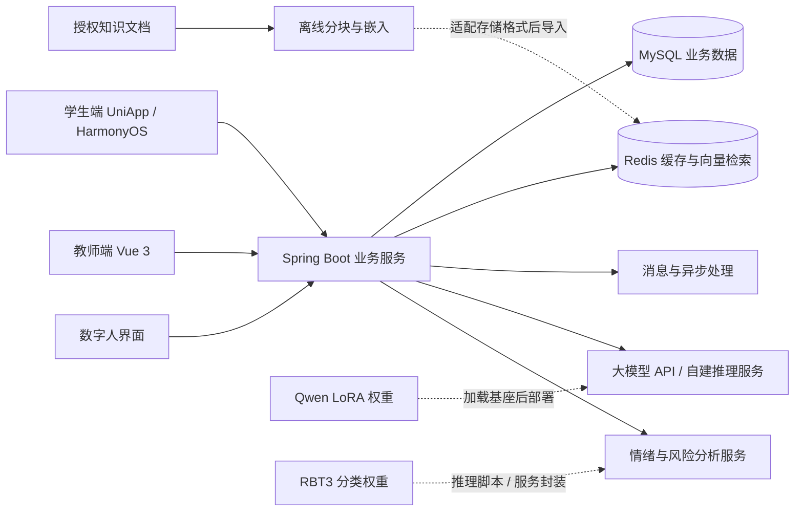

# 心晴：功能与技术说明

## 项目要解决的问题

学生的情绪记录、心理知识、测评和咨询预约常分散在不同入口；教师处理内容、预约和学生反馈时，也需要跨页面查找信息。心晴把这些流程放进同一套学生端与教师端应用，并加入 AI 对话、检索和数字人交互，探索校园心理支持服务的产品形态。

一次典型使用过程是：学生记录心情或发起对话，按需要浏览知识、进行测评、参加放松活动，再选择预约教师；教师在工作台处理预约、交流和需要人工复核的信息。模型用于辅助回应和信息整理，测评与预警并不构成医学诊断。

## 功能地图

| 模块 | 学生侧 | 教师与服务侧 | 源码入口 |
| --- | --- | --- | --- |
| AI 陪聊 | 流式文本对话、数字人交互、对话中的功能推荐 | 模型接入、消息管理、工具调用 | `mobile/function_pages/`、`backend/.../controller/ai/` |
| 日常记录 | 心情日记、情绪历史、个人资料 | 学生信息与分析相关界面 | `mobile/mine_pages/`、`admin/src/views/teacher/` |
| 心理测评 | 问卷作答、结果与历史查询 | 量表相关数据与管理接口 | `mobile/function_pages/`、后端 controller/service |
| 咨询服务 | 查找教师、预约、师生消息 | 预约处理、聊天工作台 | `admin/src/views/appointment/`、`admin/src/views/chat/` |
| 知识与社区 | 文章、帖子、活动及互动 | 内容维护、知识检索 | `mobile/group_pages/`、`backend/.../Embedding/` |
| 放松与生活 | 小游戏、音乐、运动与饮食页面 | 内容与外部接口 | `mobile/function_pages/`、`admin/src/views/sports/` |
| 风险辅助分析 | 作为服务流程中的辅助信息 | 预警页面、策略与模型配置、人工复核 | `admin/src/views/warning/`、后端 `TimeTask/warning/` |

路径中的 `backend/.../` 指 `backend/xinqing-service/src/main/java/com/hpu/xinqing/`。界面和后端接口均保留历史开发阶段差异，具体运行前提见[配置说明](CONFIGURATION.md)。

## 应用与模型怎样配合

Qwen LoRA 是对话模型的增量权重，需要搭配指定 Qwen 基座。RBT3 是独立的多任务文本分类模型。二者可以通过 `inference/` 的脚本单独运行；下载权重并不会自动把整个 Java 系统切换为本地推理，仍需按所选部署方式提供接口或修改适配层。

后端由 `xinqing-common`、`xinqing-pojo`、`xinqing-service` 三个 Maven 模块构成，分别放置公共工具、数据对象和业务逻辑。Sa-Token 处理会话；MyBatis-Plus 连接 MySQL；SSE 与 WebSocket 分别用于流式和实时交互。Spring AI、LangChain4j、模型供应商与工具接口组成 AI 集成部分。

## 版本关系

| 阶段 | 名称或内容 | 本仓库处理方式 |
| --- | --- | --- |
| 2024 | 鸿蒙心理陪聊系统、EmoChat | 保留鸿蒙端和对应获奖记录 |
| 2025 | 心晴、倾心、织心，多端校园心理支持 | 汇总完整学生端、教师端、数字人及比赛资料 |
| 2025 软件杯 | 金蝶云苍穹上的织心适配版本 | 选作最新完整演示；平台适配与通用源码分别说明 |
| 2026 | 后端鉴权、工具意图与心理预警配置更新；模型实验 | 补回较新源码，并发布实际模型权重与推理入口 |

演示视频展示 2025 年已录制的操作流程，源码与模型还包含较新的工作。不能用视频发布日期代表所有源码的版本日期。

## 文档依据

本说明综合项目源代码、用户手册、创新说明书、CRAIC 研究报告及参赛 PPT。原材料中的功能说明被整理为上述可查找的模块；没有原始评测记录支撑的临床疗效、用户规模和性能宣传未作为本仓库的验证结论。获奖证据对应见 [AWARDS.md](AWARDS.md)，发布内容对应见 [RELEASE_CONTENTS.md](RELEASE_CONTENTS.md)。
